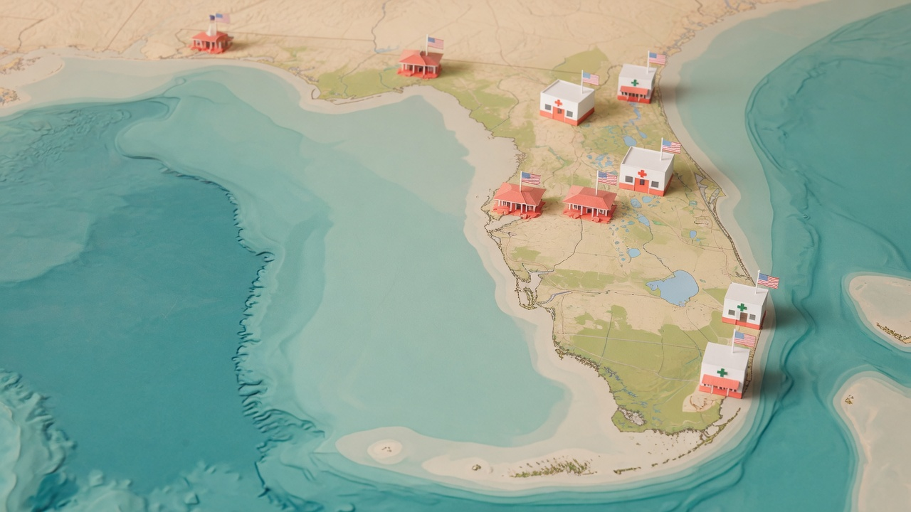
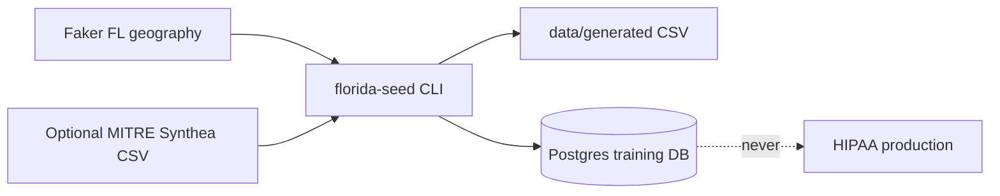

```text
███████╗██╗      ██████╗ ██████╗ ██╗██████╗  █████╗
██╔════╝██║     ██╔═══██╗██╔══██╗██║██╔══██╗██╔══██╗
█████╗  ██║     ██║   ██║██████╔╝██║██║  ██║███████║
██╔══╝  ██║     ██║   ██║██╔══██╗██║██║  ██║██╔══██║
██║     ███████╗╚██████╔╝██║  ██║██║██████╔╝██║  ██║
╚═╝     ╚══════╝ ╚═════╝ ╚═╝  ╚═╝╚═╝╚═════╝ ╚═╝  ╚═╝

███████╗███████╗███████╗██████╗
██╔════╝██╔════╝██╔════╝██╔══██╗
███████╗█████╗  █████╗  ██║  ██║
╚════██║██╔══╝  ██╔══╝  ██║  ██║
███████║███████╗███████╗██████╔╝
╚══════╝╚══════╝╚══════╝╚═════╝
```

# Florida Synthetic Health Seed

[](https://github.com/codeAmani-Labs)
[](LICENSE)
[](https://github.com/codeAmani-Labs/florida-synthetic-health)
[](https://www.python.org/)
[](SECURITY.md)
[](https://codeamanilabs.org)

**Invented** Florida patients, medical providers, clinics, pharmacies, and group homes for software testing and staff training. Not a real AHCA/APD/NPPES dump. Not PHI.

Published by **[CODEAMANI LABS LLC](https://github.com/codeAmani-Labs)** so Florida health-tech teams can seed local and staging databases without touching production records.



## Why this exists

Florida group-home and clinic vendors need **full-looking identities** (names, DOBs, test SSNs, fake Medicaid IDs, NPI-shaped tokens, addresses, med lists) to exercise EHR-ish apps, MAR flows, and reminder jobs. Real registries are the wrong source. This repo is a **public, Apache-2.0 generator** Labs uses internally and offers to other developers.

Identifiers are deliberately invalid:

| Field | Shape |
|-------|--------|
| SSN | `666-xx-xxxx` (SSA does not issue area 666) |
| Medicaid | `FLTEST########` |
| NPI token | `SYNTH-IND-#######` / `SYNTH-ORG-#######` |
| Facility license | `TEST-AHCA-#####` |
| Email | `@test.invalid` |

## Generate

```bash
python3 -m venv .venv && .venv/bin/pip install -r requirements.txt
PYTHONPATH=src .venv/bin/python -m florida_seed seed --patients 10000 --seed 42 --csv-only
```

CSV lands in `data/generated/` (gitignored). Default scale is **10,000 patients**, ~800 group homes, 400 clinics, 300 pharmacies, 2,500 providers.

Optional clinical overlay from MITRE [Synthea](https://github.com/synthetichealth/synthea) (Apache-2.0):

```bash
PYTHONPATH=src .venv/bin/python -m florida_seed fetch-synthea   # 100-patient official CSV sample
# or, with Docker + 4 GB RAM:
bash scripts/run-synthea-docker.sh 100
```

## Load Postgres

```bash
export DATABASE_URL='postgresql://…'   # staging / training only
PYTHONPATH=src .venv/bin/python -m florida_seed seed --patients 10000 --load
```

The loader **refuses** connection strings that look like the Labs HIPAA production project (`medtrack`).

CODEAMANI LABS training target (internal): Neon project `dosevault-synthetic`. Vault **name**: `NEON_SYNTHETIC_DATABASE_URL`. Never production `NEON_DATABASE_URL`.




## Schema

See [`sql/001_schema.sql`](sql/001_schema.sql): `group_homes`, `clinics`, `pharmacies`, `providers`, `patients`, `patient_providers`, `medications`.

This is a **generic Florida training model**, not a dump of any customer EHR. Map it into your app behind an adapter.

## License

Apache-2.0. Please keep the SYNTHETIC notices if you redistribute generated files.

`BUILT BY MOTIONSTACK STUDIOS` https://motionstackstudios.com/contact · `POWERED BY CODEAMANI LABS` https://codeamanilabs.org
